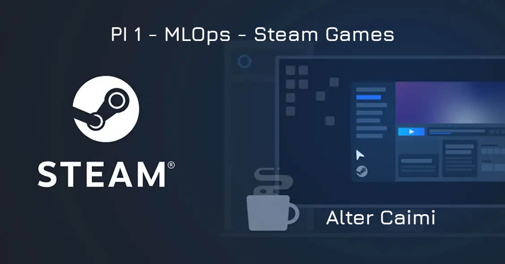
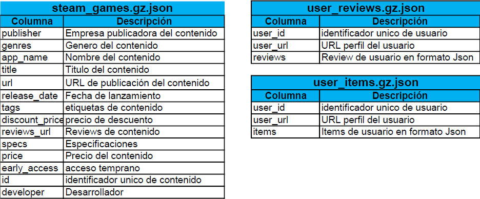
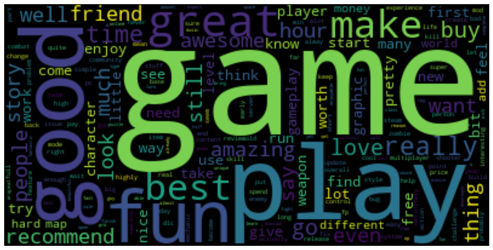

# Proyecto Individual N°1 - MLOps  
En este repositorio encontrarás el desarrollo del proyecto individual N°1, MLOps, correspondiente a la etapa Labs del Bootcamp Henry.  

## Objetivo  
Situándonos en el rol de Data Scientist, desarrollaremos un Sistema de Recomendación para la plataforma de videojuegos online Steam Games. El MVP debe desplegarse como una API que pueda ser consumida desde la Web. 

## Stack utilizado  
      

## Fuente de datos 
Los datasets provistos son tres archivos JSON comprimidos, accesibles en este [link](https://drive.google.com/drive/folders/1HqBG2-sUkz_R3h1dZU5F2uAzpRn7BSpj). 
Allí también encontrarás el diccionario de datos, con las descripciones de algunas columnas de los datasets.  
* 'australian_user_reviews.json': en este archivo se encuentran los comentarios (reviews) de los usuarios de Australia a los juegos de la plataforma. Además de la review, hay una columna 'recommend' que toma valor 'True' en caso de que el usuario recomiende el juego, y 'False' en caso contrario.
* 'australian_users_items': en este archivo se encuentran todos los usuarios de Australia, y para cada usuario detalles sobre los juegos comprados (como tiempo de juego).
* 'output_steam_games': aquí se encuentran los detalles de los juegos de steam, como género, tags, especificaciones.  

  

## ETL  
El proceso de Extracción, Transformación y Carga fue desarrollado en tres jupyter notebooks por separado, en los cuales se realizó la limpieza de los datos (eliminaciónd e duplicados, eliminación de filas vacías, tratamiento de nulos). Puedes encontrarlos [aquí](ETL/).  
En cada uno de los archivos encontrarás el código comentado que permitirá entender las modificaciones realizadas. Los datos resultantes fueron exportados en formato parquet y los puedes encontrar [aquí](CleanData/)  

## EDA  
Luego de realizada la limpieza de los datos, se realizó un [Análisis Exploratorio de Datos](EDA_steam.ipynb). El objetivo del análisis es entender las relaciones entre los diferentes datos, encontrar insights que permitan mejorar la interpreatación de los mismos y retroalimentar el desarrollo del modelo con nuevas perspectivas. En el notebook encontrarás visualizaciones que muestran información interesante, como qué géneros de juego son los más consumidos, los más caros, o qué palabras son las más frecuentes en los títulos.  
La siguiente gráfica muestra los 10 juegos más recomendados.

## Análisis de sentimiento  
Se realizó un [análisis de sentimiento](sentiment_analysis.ipynb) de la columna 'reviews' del archivo users_reviews. De esta manera se clasificó a los comentarios en tres categorías con tres valores numérivos:
- Comentarios positivos: 2
- Comentarios neutrales: 1
- Comentarios negativos: 0  
De esta manera, cada comentario quedó dentro de una categoría. A su vez, cada juego tiene normalmente más de un comentario, que pueden tomar cualquiera de los tres valores. 
La siguiente nube de palabras corresponde a las palabras (lematizadas) más frecuentes en los comentarios positivos.  

## Sistema de recomendación  
Se optó por desarrollar el sistema de recomendación ítem-ítem, basado en la distancia de coseno. Así, mediante feature engineering, cada ítem es un vector cuyas componentes son las siguientes características:
- precio: precio en dólares del videojuego (float)
- tag_x: serie de columnas dummie que corresponden a los tags (binario)
- genre_x: serie de columnas dummie que correponden a los géneros (binario)
- spec_x: serie de columnas dummie que corresponden a las especificaciones (binario)
- año: año de publicación (int)
- playtime_forever: tiempo de juego histórico del ítem, escalado mediante z-score (float)
- playtime_2weeks: tiempo de juego de las últimas 2 semanas del ítem, escalado mediante z-score (float)
- rating: suma de las calificaciones (0, 1, 2) de cada item (int)
- recommend: suma de las recomendaciones de cada item (int)  
En el [jupyter notebook](Recommender%20System/item_item_recom.ipynb) encontrarás más detalles sobre la construcción de características.

## Despliegue de la API
La API se desarrolló utilizando el framework FastAPI, que permitió poner a prueba los endpoints de manera local. Luego se optó por el despliegue en Render para acceso desde la Web.  
Puedes entrar a la API haciendo [click aquí](https://steam-mlops-4stb.onrender.com).  
Los endpoints son los siguientes:
- Endpoint 1: /developer/{desarrollador}: Retorna la cantidad de items y el porcentaje de contenido gratuito para cada año para el desarrollador ingresado.
- Endpoint 2: /userdata/{user_id}: Para el usuario ingresado, retorna el dinero gastado, el porcentaje de recomendación y la cantidad de ítems comprados.
- Endpoint 3: /UserForGenre/{genero}: Para el género ingresado, retorna el usuario con más horas jugadas y el detalle de cuántas horas por año.
- Endpoint 4: /best_developer_year/{anio}: Para el año ingresado, retorna los 3 desarrolladores con más comentarios positivos.
- Endpoint 5: /developer_reviews_analysis/{desarrolladora}: para el developer ingresado, retorna la cantidad de comentarios positivos y negativos totales.
- Endpoint 6: /recomendacion_juego/{id_producto}: para el id de producto ingresado, recomienda 5 juegos relacionados.  
Recuerda que puedes consultar la documentación de la API agregando [/docs](https://steam-mlops-4stb.onrender.com/docs). 

## Autor
Alter Caimi  
[Linkedin](https://www.linkedin.com/in/alter-caimi)  
[Instagram](https://www.instagram.com/alt3rk/)  